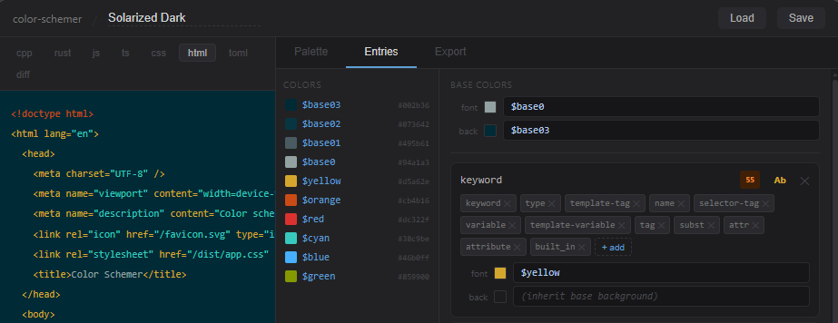

# color-schemer

A browser-based tool for designing parametric syntax highlighting color schemes,
with live preview across multiple languages and export to highlight.js CSS.

## Concepts

A scheme has a **palette** — a named set of OKLCH colors and scalar values.
Each **entry** maps one or more highlight.js scope names to colors defined by
formulas over the palette (e.g. `lighten($base0, 0.1)`, `mix($cyan, $blue, 0.5)`).
Entries inherit the base font/background when their formula is left empty.
The APCA contrast score for each entry is shown alongside the preview swatch.

## Parametric editing

Rather than picking a fixed color for each syntax role, you define a small palette
and write formulas that derive entry colors from it. Changing one palette color
ripples through every entry that references it.

Formulas use OKLCH color values and a small expression language:

    $cyan                          # palette color directly
    lighten($base0, 0.15)          # adjust lightness
    mix($blue, $cyan, 0.4)         # blend two palette colors
    oklch($base0.l, $cyan.c, $blue.h)  # recombine components
    darken($yellow, $dim)          # scalar as argument

Scalars are single numbers in the palette (e.g. `dim = 0.6`) useful for
consistent adjustments across entries. The base font and background colors
are also formula-driven and act as the inherited fallback for every entry.

## Stack

Svelte 5, TypeScript, Vite, deployed via Wrangler to Cloudflare Pages.

## Commands

    npm run dev       # start local dev server
    npm test          # run unit tests (vitest)
    npm run build     # production build
    npm run deploy    # build + deploy to Cloudflare Pages
